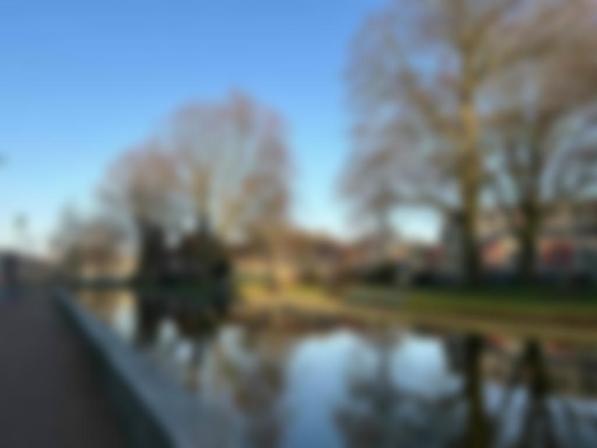
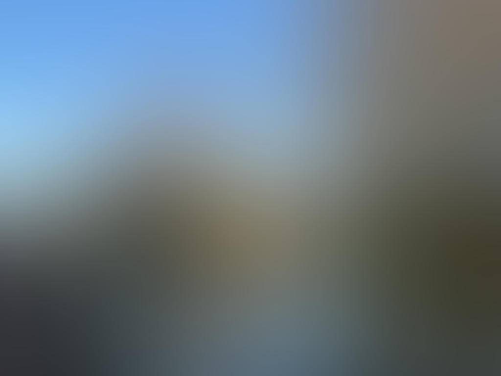

# Blurring Images

The method [blur](https://docs.rs/image/latest/image/enum.DynamicImage.html#method.blur) makes neighboring pixels of an image similar.

```rust
fn main() {
    let img = image::open("my_image.jpg").unwrap();

    let img2 = img.blur(10.);
    img2.save("blur.jpg").unwrap();
}
```

Original image:


blur.jpg:



The parameter of [blur](https://docs.rs/image/latest/image/enum.DynamicImage.html#method.blur) controls how similar the neighboring pixels are.
Applying a larger parameter makes the pixels more similar.
The following picture shows the result when the parameter is `100`.



Use [fast_blur](https://docs.rs/image/latest/image/enum.DynamicImage.html#method.fast_blur) for similar results but with faster runtime.

:arrow_right:  Next: [Making Images Clearer](./making_images_clearer.md)

:blue_book: Back: [Table of contents](./../README.md)
