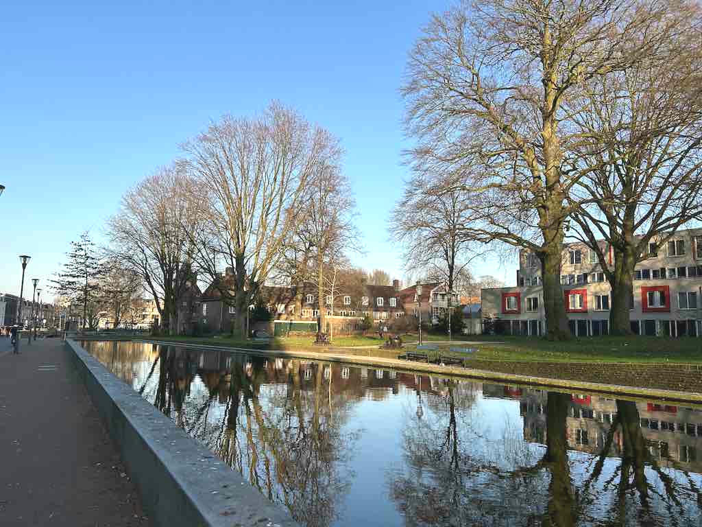
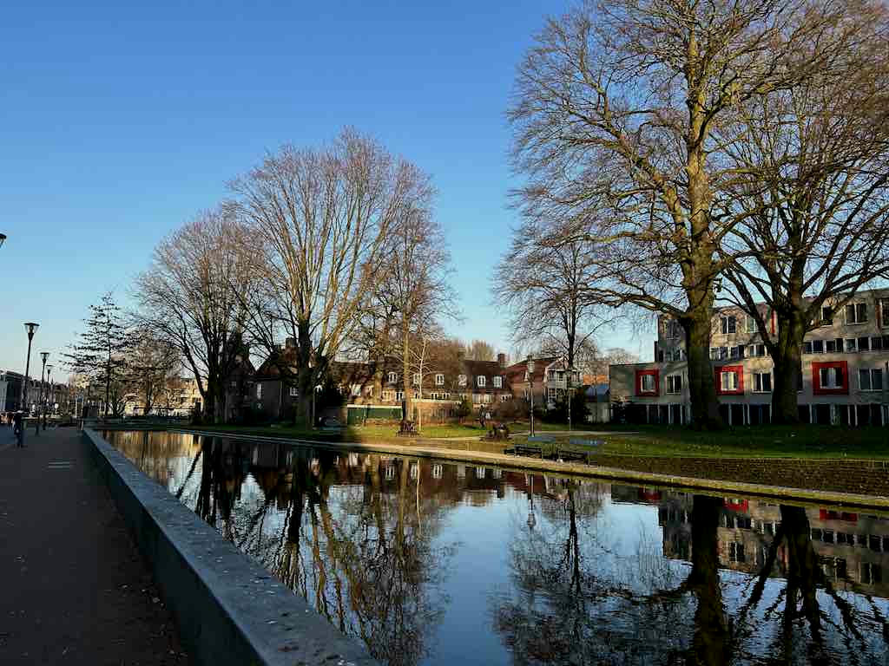

# Brightening Images

Another main property of a color is brightness.
We can change the brightness by [brighten](https://docs.rs/image/latest/image/enum.DynamicImage.html#method.brighten).

```rust
fn main() {
    let img = image::open("my_image.jpg").unwrap();

    let img2 = img.brighten(20);
    img2.save("brighten_positive.jpg").unwrap();

    let img3 = img.brighten(-20);
    img3.save("brighten_negative.jpg").unwrap();
}
```

When the parameter of [brighten](https://docs.rs/image/latest/image/enum.DynamicImage.html#method.brighten) is positive, the brightness increases.
On the other hand, when the parameter is negative, the brightness decreases.

Original image:


brighten_positive.jpg:



brighten_negative.jpg:



:arrow_right:  Next: [Image Contrast](./image_contrast.md)

:blue_book: Back: [Table of contents](./../README.md)
