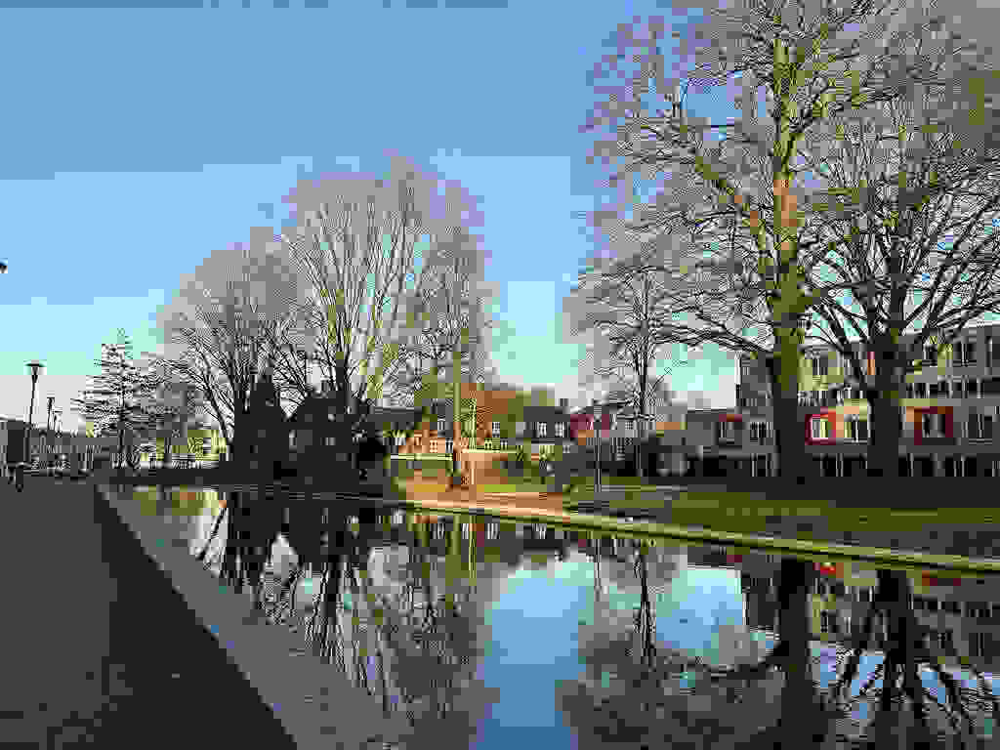

# Controlling JPEG Quality

We can manually control the quality of a JPEG image.
We use [JpegEncoder](https://docs.rs/image/latest/image/codecs/jpeg/struct.JpegEncoder.html) to help us specify the quality.

```rust
let encoder = JpegEncoder::new_with_quality(&mut file, 1);
```

The second parameter is the quality, which has a range between `1` (worst) and `100` (best).

The complete code is shown below:

```rust
use std::fs::File;
use image::codecs::jpeg::JpegEncoder;

fn main() {
    let img = image::open("my_image.jpg").unwrap();
    
    let mut file = File::create("jpeg_quality.jpg").unwrap();
    let encoder = JpegEncoder::new_with_quality(&mut file, 1);

    img.write_with_encoder(encoder).unwrap();
}
```

jpeg_quality.jpg:



<!-- :arrow_right:  Next:  -->

:blue_book: Back: [Table of contents](./../README.md)
