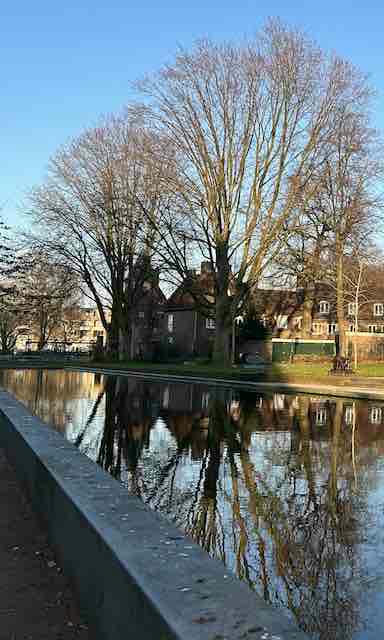

# Cropping

It is easy to obtain a sub-image of a given image.
We can use [crop_imm](https://docs.rs/image/latest/image/enum.DynamicImage.html#method.crop_imm) to select a rectangular area and output the area as an image.

```rust
fn main() {
    let img = image::open("my_image.jpg").unwrap();

    let img2 = img.crop_imm(128, 128, 384, 640);
    img2.save("crop.jpg").unwrap();
}
```

Original image:


crop.jpg:



:arrow_right:  Next: [Resizing While Preserving Aspect Ratios](./resizing_while_preserving_aspect_ratios.md)

:blue_book: Back: [Table of contents](./../README.md)
