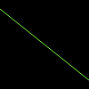

# Drawing Antialiased Lines

The line we drew in the previous tutorial looks like stairs due to the low image resolution.
To solve this problem, we can use [draw_antialiased_line_segment_mut](https://docs.rs/imageproc/latest/imageproc/drawing/fn.draw_antialiased_line_segment_mut.html).
The function needs an extra parameter that describes how to fix the stairs problem.
As suggested by the document, we use [pixelops::interpolate](https://docs.rs/imageproc/latest/imageproc/pixelops/fn.interpolate.html) for the parameter.

```rust
use imageproc::{drawing, image, pixelops};

fn main() {
    let mut buf = image::ImageBuffer::new(100, 100);
    
    drawing::draw_antialiased_line_segment_mut(
        &mut buf,
        (0, 10),
        (100, 90),
        image::Rgb::from([128u8, 255u8, 64u8]),
        pixelops::interpolate,
    );

    buf.save("antialiased_line.png").unwrap();
}
```

antialiased_line.png:



Note that the two end points of the line is of type `(i32, i32)` instead of `(f32, f32)`, which is used by [draw_line_segment_mut](https://docs.rs/imageproc/latest/imageproc/drawing/fn.draw_line_segment_mut.html).

To draw on a copy of the image, we can use [draw_antialiased_line_segment](https://docs.rs/imageproc/latest/imageproc/drawing/fn.draw_antialiased_line_segment.html).

:arrow_right:  Next: [Drawing Rectangles](./drawing_rectangles.md)

:blue_book: Back: [Table of contents](./../README.md)
