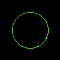

# Drawing Circles

To draw a circle, we can use [draw_filled_circle_mut](https://docs.rs/imageproc/latest/imageproc/drawing/fn.draw_filled_circle_mut.html).
The function needs the center position and the radius of the circle.

```rust
use imageproc::{drawing, image};

fn main() {
    let mut buf = image::ImageBuffer::new(100, 100);

    drawing::draw_filled_circle_mut(
        &mut buf,
        (50, 50),
        30,
        image::Rgb::from([128u8, 255u8, 64u8]),
    );

    buf.save("circle.png").unwrap();
}
```

circle.png:


To only draw the border, we can use [draw_hollow_circle_mut](https://docs.rs/imageproc/latest/imageproc/drawing/fn.draw_hollow_circle_mut.html).



To draw on a copied image, we can use [draw_filled_circle](https://docs.rs/imageproc/latest/imageproc/drawing/fn.draw_filled_circle.html) and [draw_hollow_circle](https://docs.rs/imageproc/latest/imageproc/drawing/fn.draw_hollow_circle.html).

:arrow_right:  Next: [Drawing Ellipses](./drawing_ellipses.md)

:blue_book: Back: [Table of contents](./../README.md)
