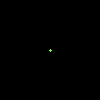

# Drawing Crosses

The [draw_cross_mut](https://docs.rs/imageproc/latest/imageproc/drawing/fn.draw_cross_mut.html) function draws five pixels that look like a cross on an image.

```rust
use imageproc::{drawing, image};

fn main() {
    let mut buf = image::ImageBuffer::new(100, 100);

    drawing::draw_cross_mut(&mut buf, image::Rgb::from([128u8, 255u8, 64u8]), 50, 50);

    buf.save("cross.png").unwrap();
}
```

cross.png:



To draw a cross on a copied image, we can use [draw_cross](https://docs.rs/imageproc/latest/imageproc/drawing/fn.draw_cross.html).

:arrow_right:  Next: [Drawing Cubic Bezier Curves](./drawing_cubic_bezier_curves.md)

:blue_book: Back: [Table of contents](./../README.md)
