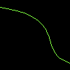

# Drawing Cubic Bezier Curves

The library helps us draw cubic [bezier curves](https://en.wikipedia.org/wiki/B%C3%A9zier_curve).
This can be done by [draw_cubic_bezier_curve_mut](https://docs.rs/imageproc/latest/imageproc/drawing/fn.draw_cubic_bezier_curve_mut.html).
A cubic bezier curve needs four points: start, end, the first control and the second control.
The curve goes from the start point and continues to the end point while considering the hints from the two control points.

```rust
use imageproc::{drawing, image};

fn main() {
    let mut buf = image::ImageBuffer::new(100, 100);

    drawing::draw_cubic_bezier_curve_mut(
        &mut buf,
        (0., 10.),
        (100., 90.),
        (100., 25.),
        (50., 75.),
        image::Rgb::from([128u8, 255u8, 64u8]),
    );

    buf.save("cubic_bezier_curve.png").unwrap();
}
```

cubic_bezier_curve.png:



To draw on a copied image, we can use [draw_cubic_bezier_curve](https://docs.rs/imageproc/latest/imageproc/drawing/fn.draw_cubic_bezier_curve.html).

<!-- :arrow_right:  Next:  -->

:blue_book: Back: [Table of contents](./../README.md)
