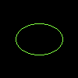

# Drawing Ellipses

Ellipses are circles that have different width and height.
We can use [draw_filled_ellipse_mut](https://docs.rs/imageproc/latest/imageproc/drawing/fn.draw_filled_ellipse_mut.html) to draw an ellipse.
It needs the center point of the ellipse, the width, the height and the color.

```rust
use imageproc::{drawing, image};

fn main() {
    let mut buf = image::ImageBuffer::new(100, 100);
    
    drawing::draw_filled_ellipse_mut(
        &mut buf,
        (50, 50),
        30,
        20,
        image::Rgb::from([128u8, 255u8, 64u8]),
    );

    buf.save("ellipse.png").unwrap();
}
```

ellipse.png:


To draw only the border, we can use [draw_hollow_ellipse_mut](https://docs.rs/imageproc/latest/imageproc/drawing/fn.draw_hollow_ellipse_mut.html).



To draw an ellipse on a copied image, we can use [draw_filled_ellipse](https://docs.rs/imageproc/latest/imageproc/drawing/fn.draw_filled_ellipse.html) and [draw_hollow_ellipse](https://docs.rs/imageproc/latest/imageproc/drawing/fn.draw_hollow_ellipse.html).

:arrow_right:  Next: [Drawing Crosses](./drawing_crosses.md)

:blue_book: Back: [Table of contents](./../README.md)
