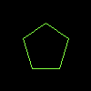

# Drawing Polygons

Rectangles in the previous tutorial has fixed number of corners.
To draw a more flexible shape, we can use [draw_polygon_mut](https://docs.rs/imageproc/latest/imageproc/drawing/fn.draw_polygon_mut.html).
It needs all the corners (each is described by a [Point](https://docs.rs/imageproc/latest/imageproc/point/struct.Point.html)) of the shape

```rust
use imageproc::{drawing, image, point::Point};

fn main() {
    let mut buf = image::ImageBuffer::new(100, 100);

    let points = [
        Point::new(50, 25),
        Point::new(75, 42),
        Point::new(65, 75),
        Point::new(35, 75),
        Point::new(25, 42),
    ];
    drawing::draw_polygon_mut(&mut buf, &points, image::Rgb::from([128u8, 255u8, 64u8]));

    buf.save("polygon.png").unwrap();
}
```

polygon.png:


To only draw the border, we can use [draw_hollow_polygon_mut](https://docs.rs/imageproc/latest/imageproc/drawing/fn.draw_hollow_polygon_mut.html).



We can also draw an antialiased polygon by [draw_antialiased_polygon_mut](https://docs.rs/imageproc/latest/imageproc/drawing/fn.draw_antialiased_polygon_mut.html).


To draw on a copied image, we can use [draw_polygon](https://docs.rs/imageproc/latest/imageproc/drawing/fn.draw_polygon.html), [draw_hollow_polygon](https://docs.rs/imageproc/latest/imageproc/drawing/fn.draw_hollow_polygon.html) and [draw_antialiased_polygon](https://docs.rs/imageproc/latest/imageproc/drawing/fn.draw_antialiased_polygon.html).

<!-- :arrow_right:  Next:  -->

:blue_book: Back: [Table of contents](./../README.md)
