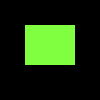
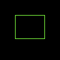

# Drawing Rectangles

We can use [draw_filled_rect_mut](https://docs.rs/imageproc/latest/imageproc/drawing/fn.draw_filled_rect_mut.html) to draw a rectangle.
The function needs a [Rect](https://docs.rs/imageproc/latest/imageproc/rect/struct.Rect.html) and the color of the rectangle.
[Rect](https://docs.rs/imageproc/latest/imageproc/rect/struct.Rect.html) describes the top-left corner of the rectangle and its width and height.
We use [Rect::at](https://docs.rs/imageproc/latest/imageproc/rect/struct.Rect.html#method.at) to set the position and [of_size](https://docs.rs/imageproc/latest/imageproc/rect/struct.RectPosition.html#method.of_size) to set the size.

```rust
use imageproc::{drawing, image, rect::Rect};

fn main() {
    let mut buf = image::ImageBuffer::new(100, 100);
    
    let rect = Rect::at(25, 25).of_size(50, 40);
    drawing::draw_filled_rect_mut(&mut buf, rect, image::Rgb::from([128u8, 255u8, 64u8]));

    buf.save("rect.png").unwrap();
}
```

rect.png:



We can also only draw the border of the rectangle.
This is done by [draw_hollow_rect_mut](https://docs.rs/imageproc/latest/imageproc/drawing/fn.draw_hollow_rect_mut.html).



To draw on a copied image, we can use [draw_filled_rect](https://docs.rs/imageproc/latest/imageproc/drawing/fn.draw_filled_rect.html) and [draw_hollow_rect](https://docs.rs/imageproc/latest/imageproc/drawing/fn.draw_hollow_rect.html).

:arrow_right:  Next: [Drawing Polygons](./drawing_polygons.md)

:blue_book: Back: [Table of contents](./../README.md)
