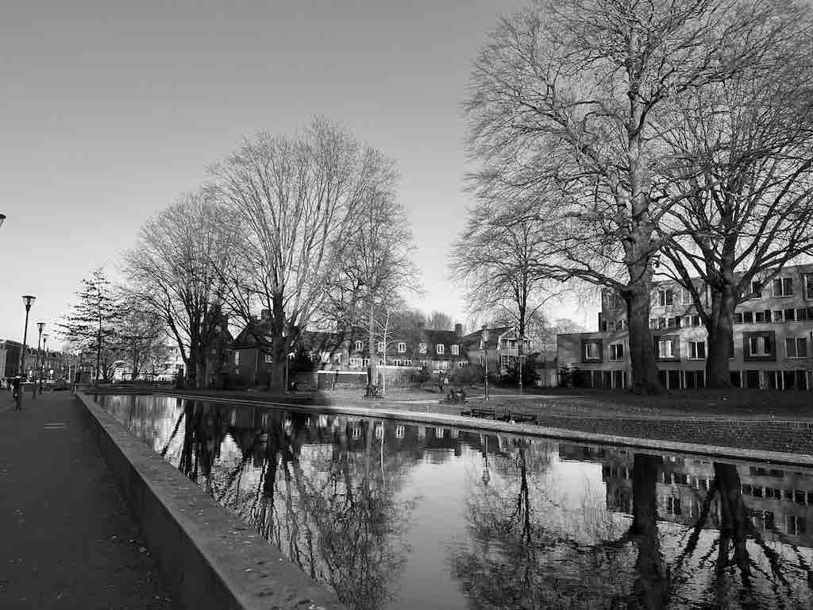

# Gray Scale

There are convenient methods to change colors of an image.
For example, to make the image be gray scale.

```rust
fn main() {
    let img = image::open("my_image.jpg").unwrap();

    let img2 = img.grayscale();
    img2.save("grayscale.jpg").unwrap();
}
```

Original image:


grayscale.jpg:



<!-- :arrow_right:  Next:  -->

:blue_book: Back: [Table of contents](./../README.md)
