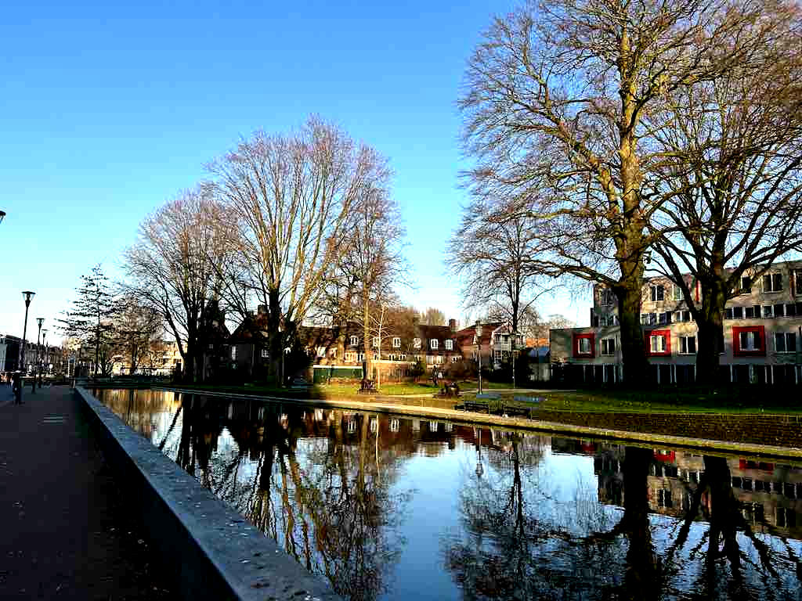
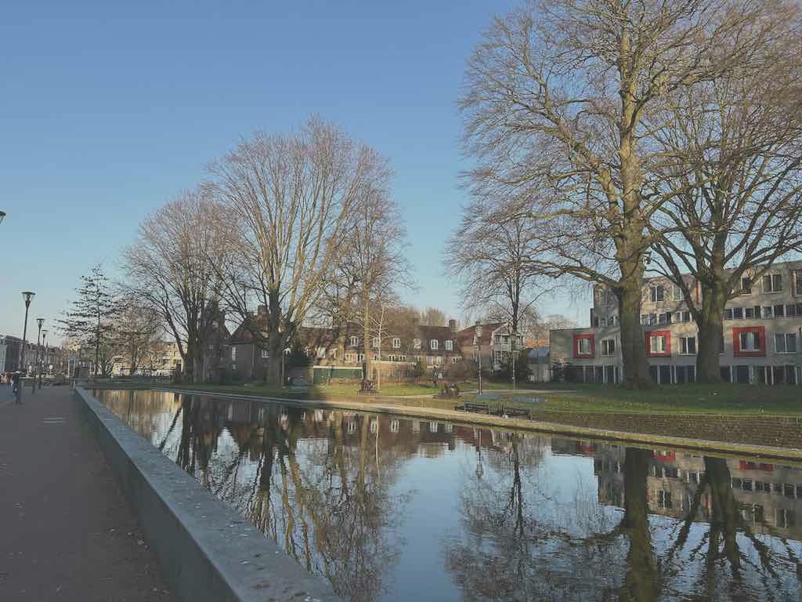

# Image Contrast

Contrast of an image means how different the image's pixels are.
The pixels in a low contrast image look similar to each other.
High contrast image makes its pixels differ a lot.

We can use [adjust_contrast](https://docs.rs/image/latest/image/enum.DynamicImage.html#method.adjust_contrast) to control the contrast of an image.

```rust
fn main() {
    let img = image::open("my_image.jpg").unwrap();
    
    let img2 = img.adjust_contrast(20.);
    img2.save("adjust_contrast_positive.jpg").unwrap();
    
    let img3 = img.adjust_contrast(-20.);
    img3.save("adjust_contrast_negative.jpg").unwrap();
}
```

A positive parameter of [adjust_contrast](https://docs.rs/image/latest/image/enum.DynamicImage.html#method.adjust_contrast) increases the contrast and a negative parameter decreases the contrast.

Original image:


adjust_contrast_positive.jpg:



adjust_contrast_negative.jpg:



:arrow_right:  Next: [Blurring Images](./blurring_images.md)

:blue_book: Back: [Table of contents](./../README.md)
