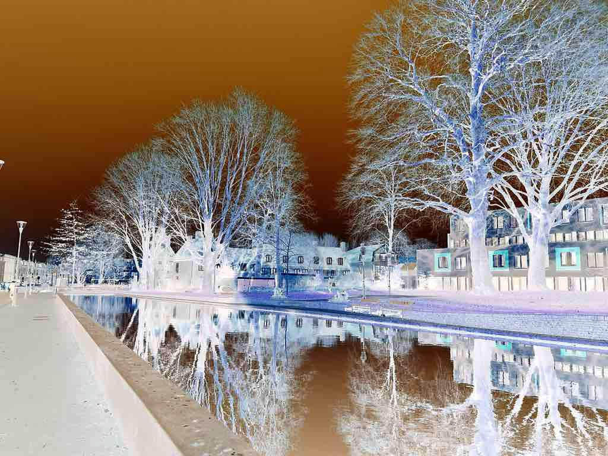

# Inverting Colors

Another convenient way to change colors of an image is [invert](https://docs.rs/image/latest/image/enum.DynamicImage.html#method.invert).

```rust
fn main() {
    let mut img = image::open("my_image.jpg").unwrap();
    
    img.invert();
    img.save("invert.jpg").unwrap();
}
```

Original image:


invert.jpg:



Note that [invert](https://docs.rs/image/latest/image/enum.DynamicImage.html#method.invert) will not create new images.
It updates the original image in place.

:arrow_right:  Next: [Rotating Colors](./rotating_colors.md)

:blue_book: Back: [Table of contents](./../README.md)
