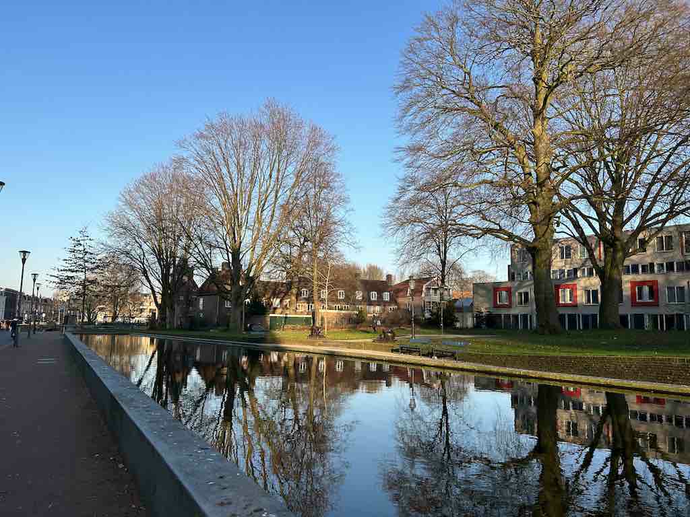

# Loading And Saving Image Files

We can use [image::open](https://docs.rs/image/latest/image/fn.open.html) to load an image file and use [save](https://docs.rs/image/latest/image/enum.DynamicImage.html#method.save) to save an image.

```rust
fn main() {
    let img = image::open("my_image.jpg").unwrap();
    img.save("saved_image.png").unwrap();
}
```

my_image.jpg:


saved_image.png:


The [save](https://docs.rs/image/latest/image/enum.DynamicImage.html#method.save) method derives the image format from the file extension automatically.
Check [here](https://github.com/image-rs/image?tab=readme-ov-file#supported-image-formats) to see all the supported image formats.

We can also use [save_with_format](https://docs.rs/image/latest/image/enum.DynamicImage.html#method.save_with_format) to save an image with an explicitly specified image format.

<!-- :arrow_right:  Next:  -->

:blue_book: Back: [Table of contents](./../README.md)
