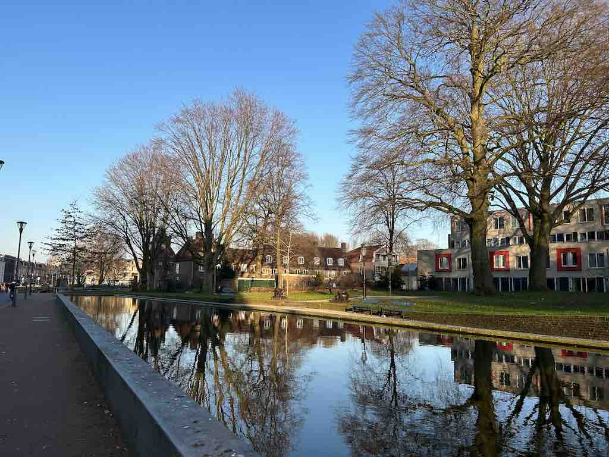
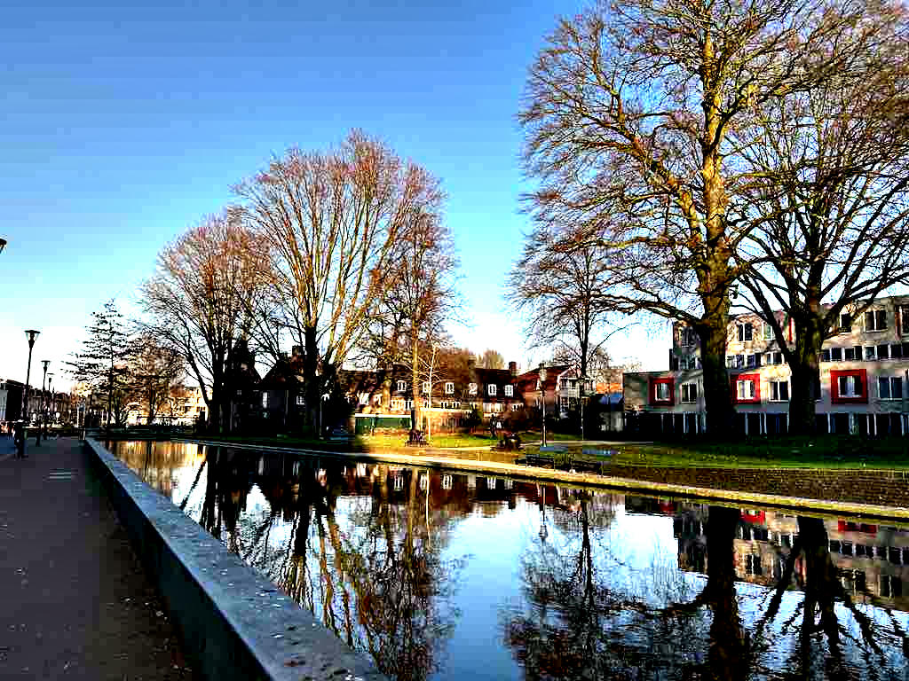

# Making Images Clearer

To make the details of an image clearer, we can use [unsharpen](https://docs.rs/image/latest/image/enum.DynamicImage.html#method.unsharpen).

```rust
fn main() {
    let img = image::open("my_image.jpg").unwrap();

    let img2 = img.unsharpen(10., 0);
    img2.save("unsharpen.jpg").unwrap();
}
```

Original image:



unsharpen.jpg:


A larger first parameter ignores more details.
For example, making the first parameter `100` provides the following result.



Keep the second parameter small to get better results.

<!-- :arrow_right:  Next:  -->

:blue_book: Back: [Table of contents](./../README.md)
