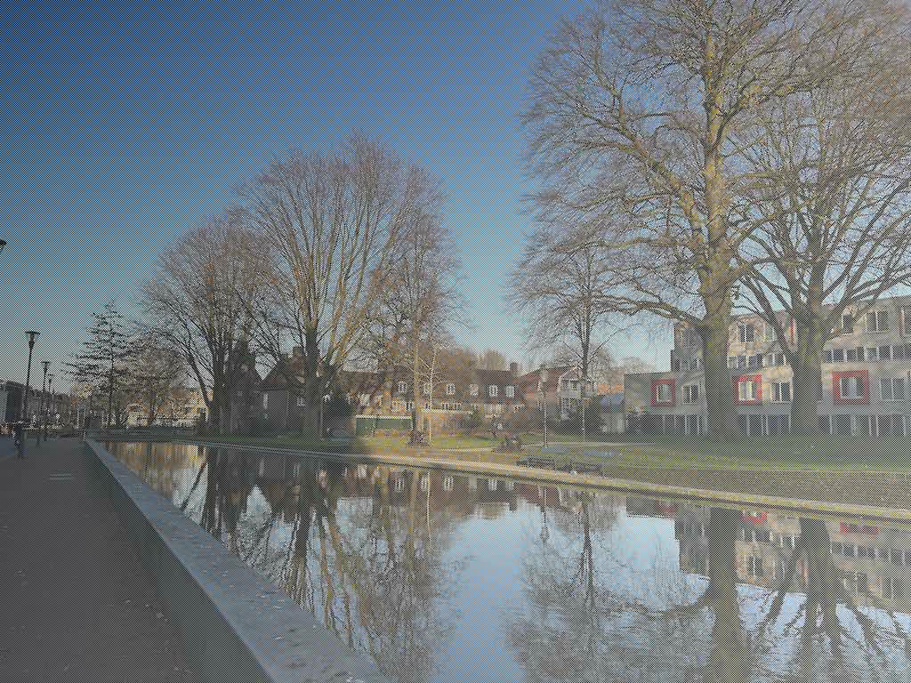

# Manipulating Pixels

We can manipulate each pixel in an image.
To do this, we first initialize an [ImageBuffer](https://docs.rs/image/latest/image/struct.ImageBuffer.html) with the image width and height.

```rust
let mut buf = ImageBuffer::new(width, height);
```

Then we can access the pixel located at the position `(i, j)` by the array-like index.

```rust
buf[(i, j)]
```

Through the index, we can read and write the value of the corresponding pixel.
Note that `(0, 0)` indicates the top-left corner of the image.

Here is the complete code that draws a gradient manually:

```rust
use image::{ImageBuffer, Rgb};

fn main() {
    let width = 1024;
    let height = 768;
    let mut buf = ImageBuffer::new(width, height);

    for i in 0..width {
        for j in 0..height {
            let value = (i + j) as f32 / (width + height) as f32;
            let value = (value * 255.) as u8;
            buf[(i, j)] = Rgb::from([value, value, value]);
        }
    }

    buf.save("image_buffer.jpg").unwrap();
}
```

image_buffer.jpg:


We can also load an image, draw it on [ImageBuffer](https://docs.rs/image/latest/image/struct.ImageBuffer.html) and manipulate its pixels.

```rust
use image::{imageops, DynamicImage, ImageBuffer, Rgba};

fn main() {
    let img = image::open("my_image.jpg").unwrap();

    let width = 1024;
    let height = 768;
    let mut buf = ImageBuffer::new(width, height);

    imageops::overlay(&mut buf, &img, 0, 0);
    
    for i in 0..width {
        for j in 0..height {
            if (i + j) % 2 == 0 {
                let value = (i + j) as f32 / (width + height) as f32;
                let value = (value * 255.) as u8;
                buf[(i, j)] = Rgba::from([value, value, value, 255]);
            }
        }
    }

    let buf = DynamicImage::from(buf);
    let buf = buf.into_rgb8();
    buf.save("image_buffer_overlay.jpg").unwrap();
}
```

image_buffer_overlay.jpg:



Note that, to call [overlay](https://docs.rs/image/latest/image/imageops/fn.overlay.html) on the images, we need the two images to have the same color type.
So we use [Rgba](https://docs.rs/image/latest/image/struct.Rgba.html) instead of [Rgb](https://docs.rs/image/latest/image/struct.Rgb.html) for pixels, to match the color type of `my_image.jpg`.

In addition, to save the image as a JPEG file without any errors, we need to transform its color type appropriately.

```rust
let buf = DynamicImage::from(buf);
let buf = buf.into_rgb8();
```

We first transform the [ImageBuffer](https://docs.rs/image/latest/image/struct.ImageBuffer.html) to [DynamicImage](https://docs.rs/image/latest/image/enum.DynamicImage.html), and then transform it again to a [DynamicImage](https://docs.rs/image/latest/image/enum.DynamicImage.html) with color type `rgb8`.

<!-- :arrow_right:  Next:  -->

:blue_book: Back: [Table of contents](./../README.md)
