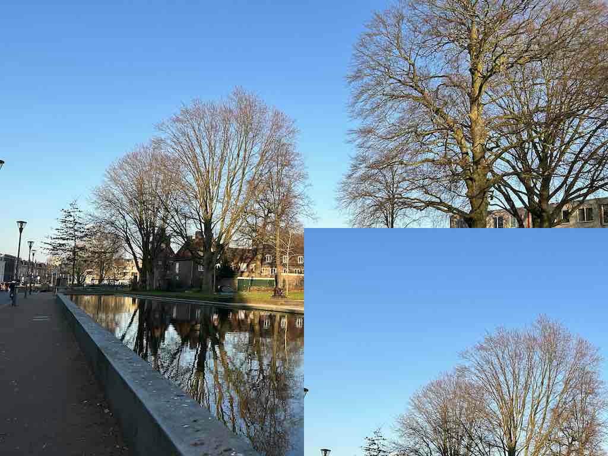

# Overlaying Images

To draw an image on top of another image, we can use [overlay](https://docs.rs/image/latest/image/imageops/fn.overlay.html) or [replace](https://docs.rs/image/latest/image/imageops/fn.replace.html) (depending on whether pixels can be transparent or not).

```rust
use image::imageops;

fn main() {
    let mut img1 = image::open("my_image.jpg").unwrap();
    let img2 = image::open("my_image.jpg").unwrap();

    imageops::overlay(&mut img1, &img2, 512, 384);
    
    img1.save("overlay.jpg").unwrap();
}
```

overlay.jpg:



Use [overlay_bounds](https://docs.rs/image/latest/image/imageops/fn.overlay_bounds.html) for more control on how to overlay the image.

<!-- :arrow_right:  Next:  -->

:blue_book: Back: [Table of contents](./../README.md)
