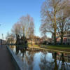

# Resizing Without Preserving Aspect Ratios

To resize an image to a specified size, we can use [resize_exact](https://docs.rs/image/latest/image/enum.DynamicImage.html#method.resize_exact).

```rust
use image::imageops::FilterType;

fn main() {
    let img = image::open("my_image.jpg").unwrap();

    let img2 = img.resize_exact(100, 100, FilterType::Triangle);
    img2.save("resize_exact.jpg").unwrap();
}
```

Original image:


resize_exact.jpg:



The new image is square as we specified.

<!-- :arrow_right:  Next:  -->

:blue_book: Back: [Table of contents](./../README.md)
