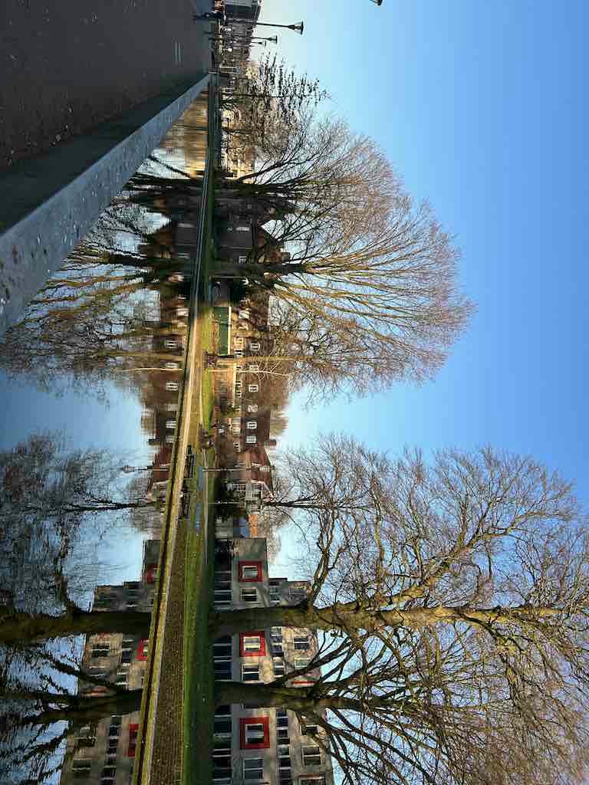
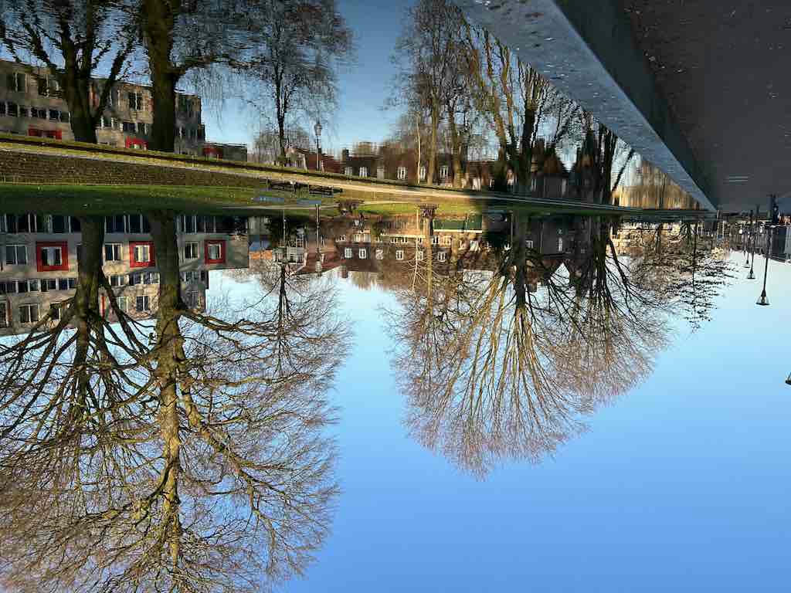
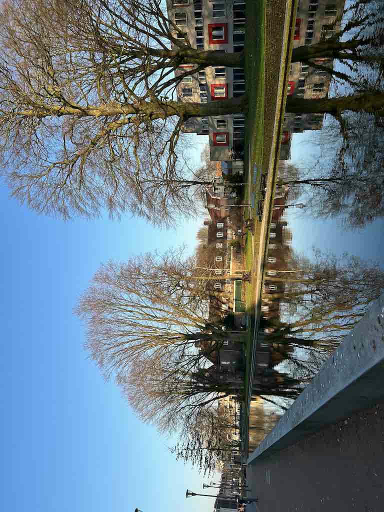

# Rotating

There are convenient methods for rotating images.
We can use [rotate90](https://docs.rs/image/latest/image/enum.DynamicImage.html#method.rotate90), [rotate180](https://docs.rs/image/latest/image/enum.DynamicImage.html#method.rotate180) and [rotate270](https://docs.rs/image/latest/image/enum.DynamicImage.html#method.rotate270) to rotate an image clockwise by the specified degree.

```rust
fn main() {
    let img = image::open("my_image.jpg").unwrap();
    
    let img_90 = img.rotate90();
    img_90.save("rotate90.jpg").unwrap();
    
    let img_180 = img.rotate180();
    img_180.save("rotate180.jpg").unwrap();
    
    let img_270 = img.rotate270();
    img_270.save("rotate270.jpg").unwrap();
}
```

Original image:


rotate90.jpg:



rotate180.jpg:



rotate270.jpg:



We can also use [apply_orientation](https://docs.rs/image/latest/image/enum.DynamicImage.html#method.apply_orientation) to achieve the same results.

<!-- :arrow_right:  Next:  -->

:blue_book: Back: [Table of contents](./../README.md)
