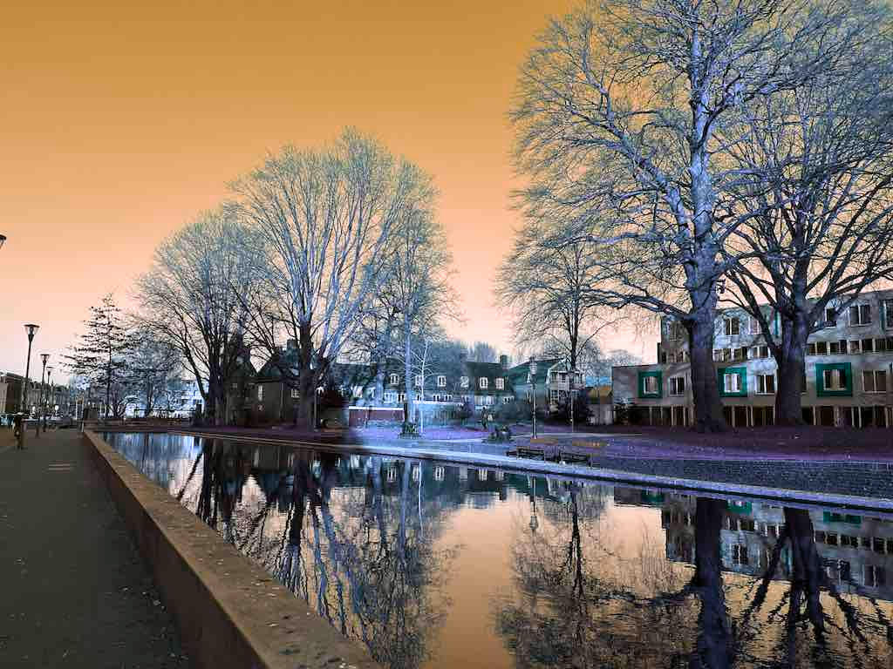

# Rotating Colors

[Hue](https://en.wikipedia.org/wiki/Hue) is one of the main properties of a color.
There is a method [huerotate](https://docs.rs/image/latest/image/enum.DynamicImage.html#method.huerotate), which only changes the hue and leaves the other properties of colors unchanged.

```rust
fn main() {
    let img = image::open("my_image.jpg").unwrap();

    let img2 = img.huerotate(180);
    img2.save("huerotate.jpg").unwrap();
}
```

The parameter range of [huerotate](https://docs.rs/image/latest/image/enum.DynamicImage.html#method.huerotate) is from `0` to `360`, where both `0` and `360` make the image unchanged.
The parameter `180` makes all hues to be opposite.

Original image:


huerotate.jpg:



Note that calling `huerotate(180)` is different from [invert](https://docs.rs/image/latest/image/enum.DynamicImage.html#method.invert), which also inverts other properties of a color.

:arrow_right:  Next: [Brightening Images](./brightening_images.md)

:blue_book: Back: [Table of contents](./../README.md)
