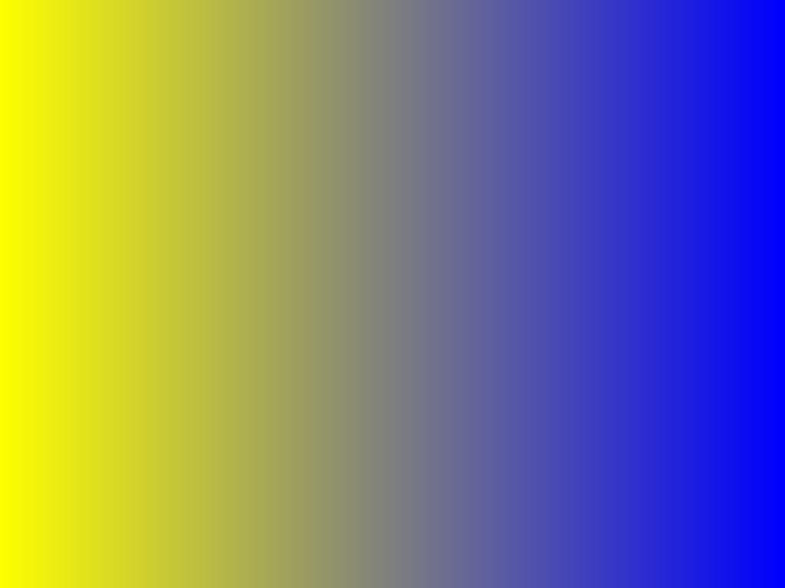

# Simple Gradient

The library provides convenient functions for creating horizontal and vertical gradients.
We can call [horizontal_gradient](https://docs.rs/image/latest/image/imageops/fn.horizontal_gradient.html) and [vertical_gradient](https://docs.rs/image/latest/image/imageops/fn.vertical_gradient.html) to create the gradients respectively.

```rust
use image::{imageops, Rgba};

fn main() {
    let mut img = image::open("my_image.jpg").unwrap();

    imageops::horizontal_gradient(
        &mut img,
        &Rgba::from([255, 255, 0, 255]),
        &Rgba::from([0, 0, 255, 255]),
    );

    img.save("horizontal_gradient.jpg").unwrap();
}
```

horizontal_gradient.jpg:



To specify the two colors of the gradient, we pass two [Rgba](https://docs.rs/image/latest/image/struct.Rgba.html)s, each describes a color that consists of red, green, blue and opaqueness.

[vertical_gradient](https://docs.rs/image/latest/image/imageops/fn.vertical_gradient.html) can be drawn similarly.

:arrow_right:  Next: [Manipulating Pixels](./manipulating_pixels.md)

:blue_book: Back: [Table of contents](./../README.md)
