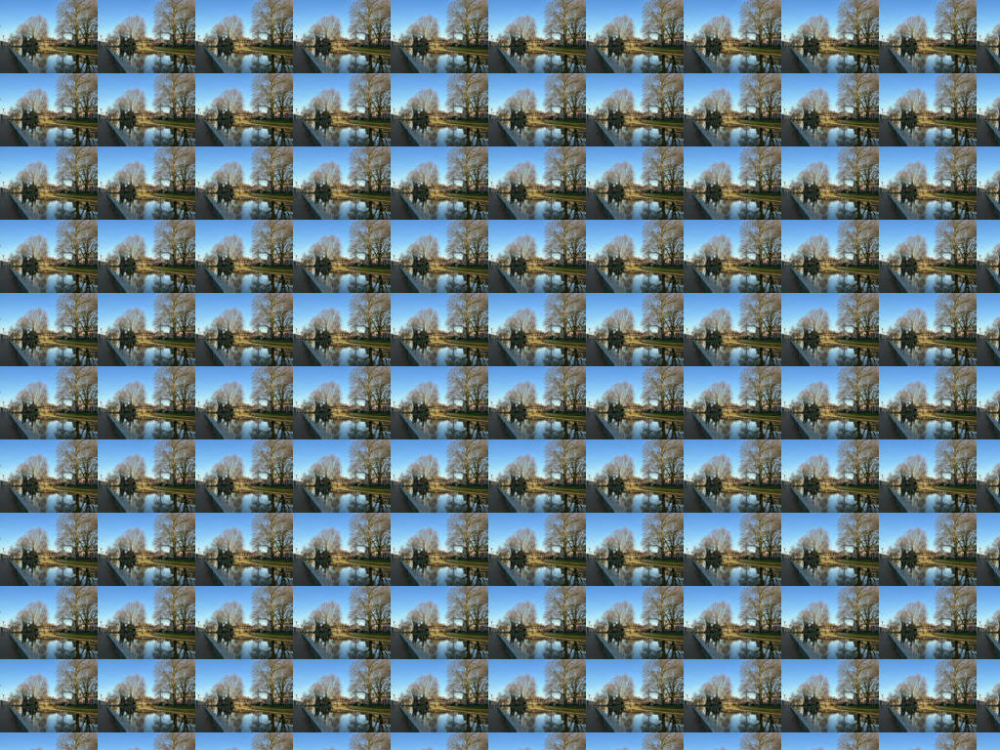

# Tiling Images

We can repeatedly draw one image to fill another image.
This can be done by [tile](https://docs.rs/image/latest/image/imageops/fn.tile.html).
In the following example, we use image `resize.jpg`, which was created in previous tutorials, as a pattern to draw on another image, `my_image.jpg`.
For ease of demonstration, the content of `my_image.jpg` will be ignored and completely replaced.
We only use the dimension of `my_image.jpg`.

```rust
use image::imageops;

fn main() {
    let mut img1 = image::open("my_image.jpg").unwrap();
    let img2 = image::open("resize.jpg").unwrap();

    imageops::tile(&mut img1, &img2);
    
    img1.save("tile.jpg").unwrap();
}
```

tile.jpg:



<!-- :arrow_right:  Next:  -->

:blue_book: Back: [Table of contents](./../README.md)
